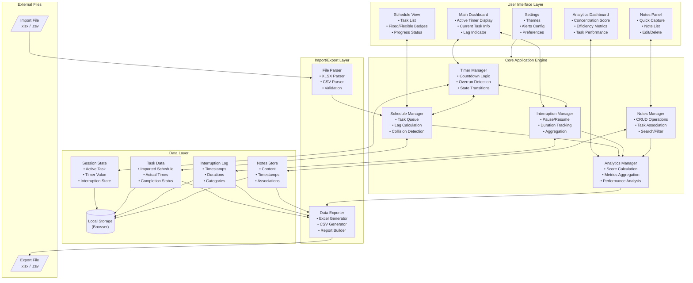
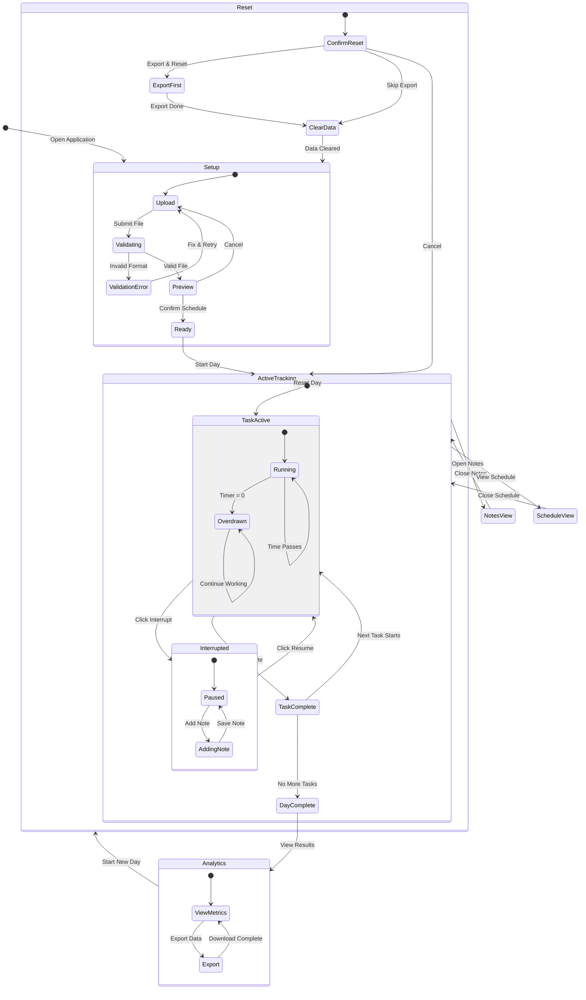
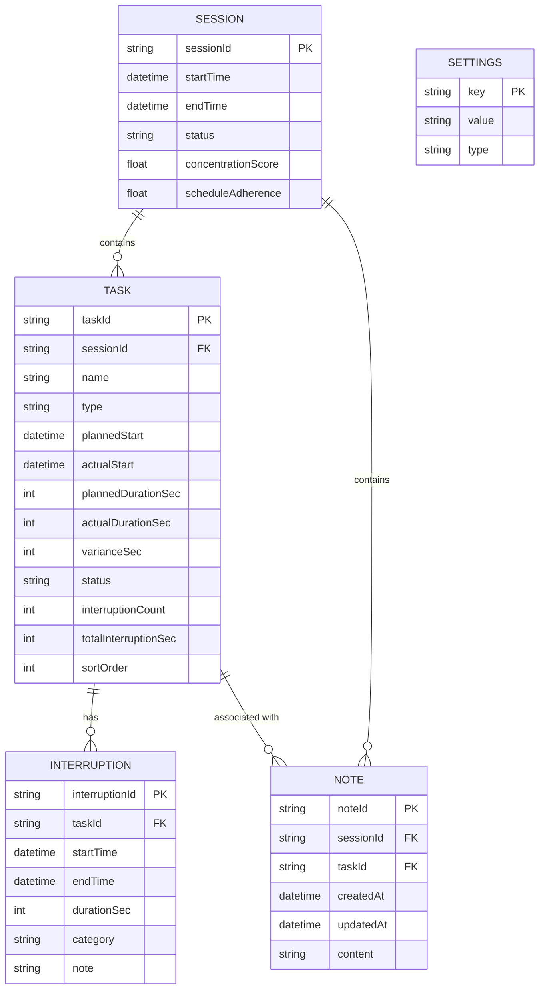

# Architecture

This document describes the system architecture for Micro Time Manager.

## Table of Contents

- [Overview](#overview)
- [Design Principles](#design-principles)
- [System Architecture](#system-architecture)
- [Application State](#application-state)
- [Data Model](#data-model)
- [Component Architecture](#component-architecture)
- [Data Flow](#data-flow)
- [Performance Considerations](#performance-considerations)
- [Security Considerations](#security-considerations)

## Overview

Micro Time Manager is a **client-side single-page application (SPA)** that runs entirely in the browser with no backend dependencies. This architecture ensures privacy, offline capability, and zero infrastructure costs.

## Design Principles

| Principle | Implementation |
|-----------|----------------|
| **Offline-First** | All data stored in browser localStorage; no network required |
| **Privacy-Focused** | Data never leaves the user's device unless explicitly exported |
| **Responsive** | Mobile-first CSS with breakpoints for tablet and desktop |
| **Zero Dependencies** | Minimal external libraries; Svelte compiles to vanilla JS |
| **Data Portability** | Standard Excel/CSV export for external analysis |

## System Architecture

The application follows a layered architecture with clear separation of concerns:



### Layer Descriptions

| Layer | Responsibility |
|-------|----------------|
| **User Interface** | Svelte components for rendering and user interaction |
| **Core Engine** | Business logic in TypeScript service modules |
| **Data Layer** | State management via Svelte stores + localStorage persistence |
| **I/O Layer** | File parsing (SheetJS) and export generation |

## Application State

The application transitions through well-defined states:



## Data Model

Entity relationships for persistent data:



See [DATA_SCHEMA.md](DATA_SCHEMA.md) for detailed localStorage schema and file format specifications.

## Component Architecture

### UI Components (Implemented)

| Component | Purpose | Key Functions |
|-----------|---------|---------------|
| **TimerDisplay** | Show countdown/overrun | Render time with color states (green/yellow/red) |
| **CurrentTask** | Current task info | Name, type badge, task index |
| **TaskControls** | Session control buttons | Start Day, Complete Task, End Day |
| **ImpactPanel** | Show all tasks with projections | Task list, drag reorder, real-time projections |
| **ImpactTaskRow** | Individual task in panel | Time, duration, name, type badge, drag handle |
| **EditTaskDialog** | Edit task properties | Modal for name, time, duration, type editing |
| **FileUploader** | Import spreadsheet | Drag-drop, file validation |
| **SchedulePreview** | Preview imported schedule | Inline editing, task reordering |
| **TaskRow** | Task row in preview | Editable fields, drag handle |
| **TemplateDownload** | Download template file | Generate sample Excel file |
| **DaySummary** | End-of-day summary | Tasks completed, time stats |
| **FixedTaskWarning** | Alert for at-risk fixed tasks | Warning message with time info |

### Service Modules (Implemented)

| Module | Responsibility |
|--------|----------------|
| **storage** | localStorage operations with Date serialization |
| **parser** | XLSX/CSV parsing with SheetJS, schema validation |
| **timer** | Low-level timer with `performance.now()` precision |
| **projection** | Calculate projected task start times based on current progress |
| **tabSync** | Multi-tab coordination with BroadcastChannel API |
| **template** | Generate downloadable Excel template |

### Svelte Stores (Implemented)

| Store | Responsibility |
|-------|----------------|
| **sessionStore** | Day session state, task progress, current task tracking |
| **timerStore** | Timer state, elapsed time, color states |
| **importStore** | File upload workflow, draft tasks, validation |

### Component Hierarchy (Implemented)

```
+page.svelte (Main Page)
├── FileUploader              # File selection
├── TemplateDownload          # Template download
├── SchedulePreview           # Import preview
│   └── TaskRow               # Individual task editing
└── TrackingView              # Day tracking
    ├── TimerDisplay          # Countdown timer
    ├── CurrentTask           # Current task info
    ├── LagIndicator          # Schedule lag display
    ├── FixedTaskWarning      # At-risk fixed task alert
    ├── TaskControls          # Action buttons
    ├── ImpactPanel           # All tasks view
    │   ├── ImpactTaskRow     # Task row with projections
    │   └── EditTaskDialog    # Task editing modal
    └── DaySummary            # End-of-day summary
```

## Data Flow

### Import Flow

```
User selects file
       ↓
FileParser.parse(file)
       ↓
Validate schema & data types
       ↓
Transform to Task[] objects
       ↓
ScheduleManager.loadTasks(tasks)
       ↓
StorageManager.save('tasks', tasks)
       ↓
UI renders schedule preview
```

### Timer Tick Flow

```
requestAnimationFrame / setInterval(1000ms)
       ↓
TimerManager.tick()
       ↓
Calculate elapsed using performance.now()
       ↓
Check if overdrawn (remainingTime < 0)
       ↓
Update UI state via store
       ↓
ScheduleManager.calculateLag()
       ↓
Check fixed task conflicts
       ↓
Trigger warnings if needed
```

### Export Flow

```
User clicks Export
       ↓
AnalyticsManager.computeAll()
       ↓
Gather: tasks, interruptions, notes
       ↓
Exporter.generateWorkbook(data)
       ↓
Create sheets: Tasks, Interruptions, Notes, Summary
       ↓
Trigger browser download
```

## Performance Considerations

| Concern | Mitigation |
|---------|------------|
| **Timer accuracy** | Use `performance.now()` for precision; correct for drift |
| **Background tabs** | Compensate for browser throttling using timestamp deltas |
| **Large task lists** | Virtualized rendering for 100+ tasks |
| **localStorage limits** | ~5MB limit; warn user if approaching |
| **File parsing** | Web Worker for parsing large files |
| **Export generation** | Progressive generation with status updates |
| **Bundle size** | Target <50KB gzipped; tree-shake dependencies |

### Timer Implementation

Per the project constitution, timer accuracy is critical:

```typescript
// Use performance.now() for elapsed time, NOT setInterval counting
let lastTick = performance.now();

function tick() {
  const now = performance.now();
  const elapsed = (now - lastTick) / 1000;
  lastTick = now;

  remainingSeconds -= elapsed;

  requestAnimationFrame(tick);
}
```

## Security Considerations

| Aspect | Approach |
|--------|----------|
| **Data at rest** | localStorage only; data never transmitted |
| **XSS prevention** | Sanitize all user input; no `innerHTML` |
| **File validation** | Strict schema validation; reject malformed files |
| **Export safety** | Standard file formats; no executable content |

## Browser Compatibility

| Browser | Minimum Version | Notes |
|---------|-----------------|-------|
| Chrome | 90+ | Primary target |
| Firefox | 88+ | Full support |
| Safari | 14+ | Full support |
| Edge | 90+ | Chromium-based |
| Mobile Safari | iOS 14+ | Touch optimized |
| Chrome Mobile | Android 10+ | Touch optimized |

---

**Document Version:** 1.1
**Last Updated:** 2025-12-18

See also:
- [API Reference](API.md)
- [Data Schema](DATA_SCHEMA.md)
- [ADR-001: Svelte over React](decisions/001-svelte-over-react.md)
