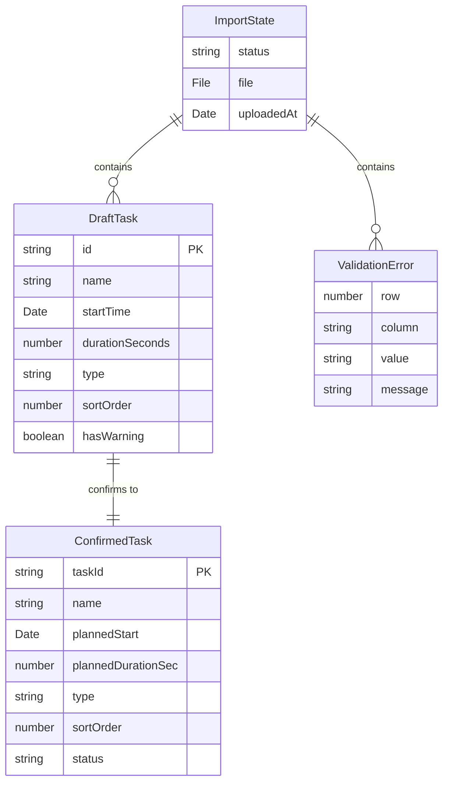

# Data Model: Schedule Import

**Feature**: 001-schedule-import
**Date**: 2025-12-17

## Entity Overview



## Entities

### ImportState

Runtime state for the import workflow. Not persisted.

| Field | Type | Description | Constraints |
|-------|------|-------------|-------------|
| status | enum | Current workflow state | `'idle' \| 'parsing' \| 'preview' \| 'error'` |
| file | File \| null | Uploaded file reference | Max 1MB |
| uploadedAt | Date \| null | Upload timestamp | Set when file accepted |

**State Transitions**:
```
idle → parsing (file uploaded)
parsing → preview (valid file)
parsing → error (invalid file)
error → idle (retry upload)
preview → idle (cancel)
preview → [confirmed] (confirm schedule)
```

### DraftTask

A task in preview state before confirmation. Editable and reorderable.

| Field | Type | Description | Constraints |
|-------|------|-------------|-------------|
| id | string | Unique identifier | UUID v4, generated on parse |
| name | string | Task name | 1-200 characters |
| startTime | Date | Planned start | Today's date + parsed time |
| durationSeconds | number | Duration in seconds | 1-86400 (max 24h) |
| type | enum | Task type | `'fixed' \| 'flexible'` |
| sortOrder | number | Display order | 0-based index |
| hasWarning | boolean | Overlap/past-due flag | Computed |

**Validation Rules**:
- `name`: Required, trimmed, max 200 chars
- `startTime`: Valid time today
- `durationSeconds`: Positive integer, max 86400
- `type`: Case-insensitive match to "fixed" or "flexible"

**Computed Properties**:
- `endTime`: startTime + durationSeconds
- `hasWarning`: true if overlaps with another task or startTime is in past

### ValidationError

An issue found during file parsing.

| Field | Type | Description | Constraints |
|-------|------|-------------|-------------|
| row | number | Spreadsheet row number | 2+ (1 is header) |
| column | string | Column name | One of required columns |
| value | string | The invalid value | Truncated to 50 chars |
| message | string | Human-readable error | Localized message |

**Error Types**:
| Code | Message Template |
|------|-----------------|
| MISSING_COLUMN | "Required column '{column}' not found" |
| EMPTY_VALUE | "Row {row}: {column} cannot be empty" |
| INVALID_TIME | "Row {row}: Invalid time format '{value}'" |
| INVALID_DURATION | "Row {row}: Invalid duration format '{value}'" |
| INVALID_TYPE | "Row {row}: Type must be 'fixed' or 'flexible', got '{value}'" |
| FILE_TOO_LARGE | "File exceeds 1MB limit" |
| TOO_MANY_TASKS | "Schedule exceeds 50 task limit ({count} tasks found)" |
| NO_DATA | "No tasks found. Please add at least one task row" |

### ConfirmedTask

A task after schedule confirmation. Persisted to localStorage.

| Field | Type | Description | Constraints |
|-------|------|-------------|-------------|
| taskId | string | Unique identifier | Preserved from DraftTask.id |
| name | string | Task name | Immutable after confirm |
| plannedStart | Date | Planned start time | ISO 8601 string in storage |
| plannedDurationSec | number | Planned duration | Immutable after confirm |
| type | enum | Fixed or flexible | `'fixed' \| 'flexible'` |
| sortOrder | number | Execution order | Final order from preview |
| status | enum | Completion state | `'pending' \| 'active' \| 'complete'` |

**Storage Key**: `tm_tasks`

**Storage Format** (JSON):
```json
[
  {
    "taskId": "a1b2c3d4-...",
    "name": "Email review",
    "plannedStart": "2025-12-17T09:00:00.000Z",
    "plannedDurationSec": 1800,
    "type": "flexible",
    "sortOrder": 0,
    "status": "pending"
  }
]
```

## Type Definitions

```typescript
// Import workflow state
type ImportStatus = 'idle' | 'parsing' | 'preview' | 'error';

// Task type
type TaskType = 'fixed' | 'flexible';

// Task status (post-confirmation)
type TaskStatus = 'pending' | 'active' | 'complete';

// Draft task (pre-confirmation, editable)
interface DraftTask {
  id: string;
  name: string;
  startTime: Date;
  durationSeconds: number;
  type: TaskType;
  sortOrder: number;
  hasWarning: boolean;
}

// Confirmed task (post-confirmation, persisted)
interface ConfirmedTask {
  taskId: string;
  name: string;
  plannedStart: Date;
  plannedDurationSec: number;
  type: TaskType;
  sortOrder: number;
  status: TaskStatus;
}

// Validation error
interface ValidationError {
  row: number;
  column: string;
  value: string;
  message: string;
}

// Parse result (success or failure)
type ParseResult =
  | { success: true; tasks: DraftTask[] }
  | { success: false; errors: ValidationError[] };

// Import store state
interface ImportState {
  status: ImportStatus;
  file: File | null;
  uploadedAt: Date | null;
  tasks: DraftTask[];
  errors: ValidationError[];
}
```

## Relationships

| From | To | Relationship | Description |
|------|-----|--------------|-------------|
| ImportState | DraftTask | 1:many | Import contains 0-50 draft tasks |
| ImportState | ValidationError | 1:many | Import contains 0+ errors |
| DraftTask | ConfirmedTask | 1:1 | Draft converts to confirmed on schedule confirmation |

## Invariants

1. **Mutual exclusivity**: If `status === 'preview'`, then `errors.length === 0`
2. **Task limit**: `tasks.length <= 50`
3. **Sort order uniqueness**: No two tasks share the same `sortOrder`
4. **Type immutability**: After confirmation, task type cannot change
5. **Order preservation**: Confirmed tasks maintain sortOrder from preview

## Migration Strategy

This is the initial data model. Future changes will follow constitution's schema versioning:

```typescript
// Storage key for schema version
const SCHEMA_KEY = 'tm_schema_version';
const CURRENT_VERSION = 1;

// Check and migrate on app load
function migrateIfNeeded() {
  const version = localStorage.getItem(SCHEMA_KEY);
  if (!version || parseInt(version) < CURRENT_VERSION) {
    // Run migrations
    localStorage.setItem(SCHEMA_KEY, String(CURRENT_VERSION));
  }
}
```
