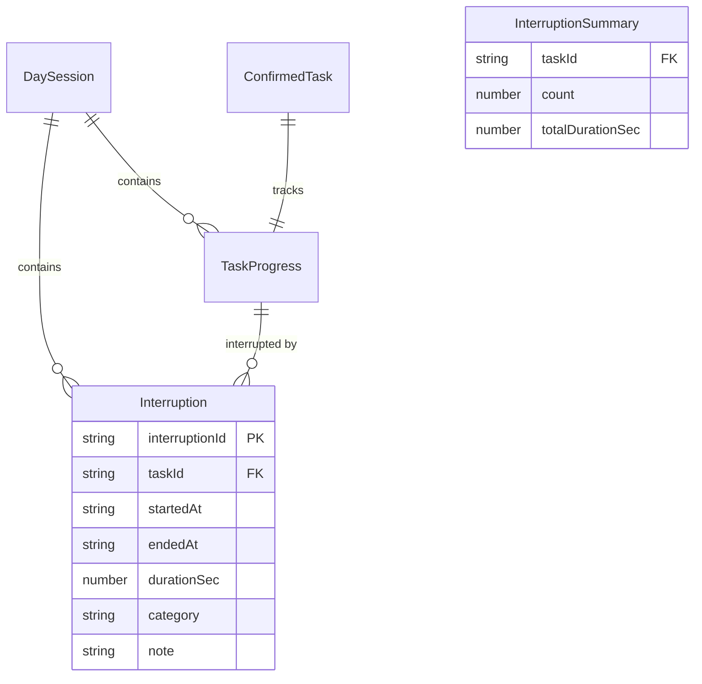
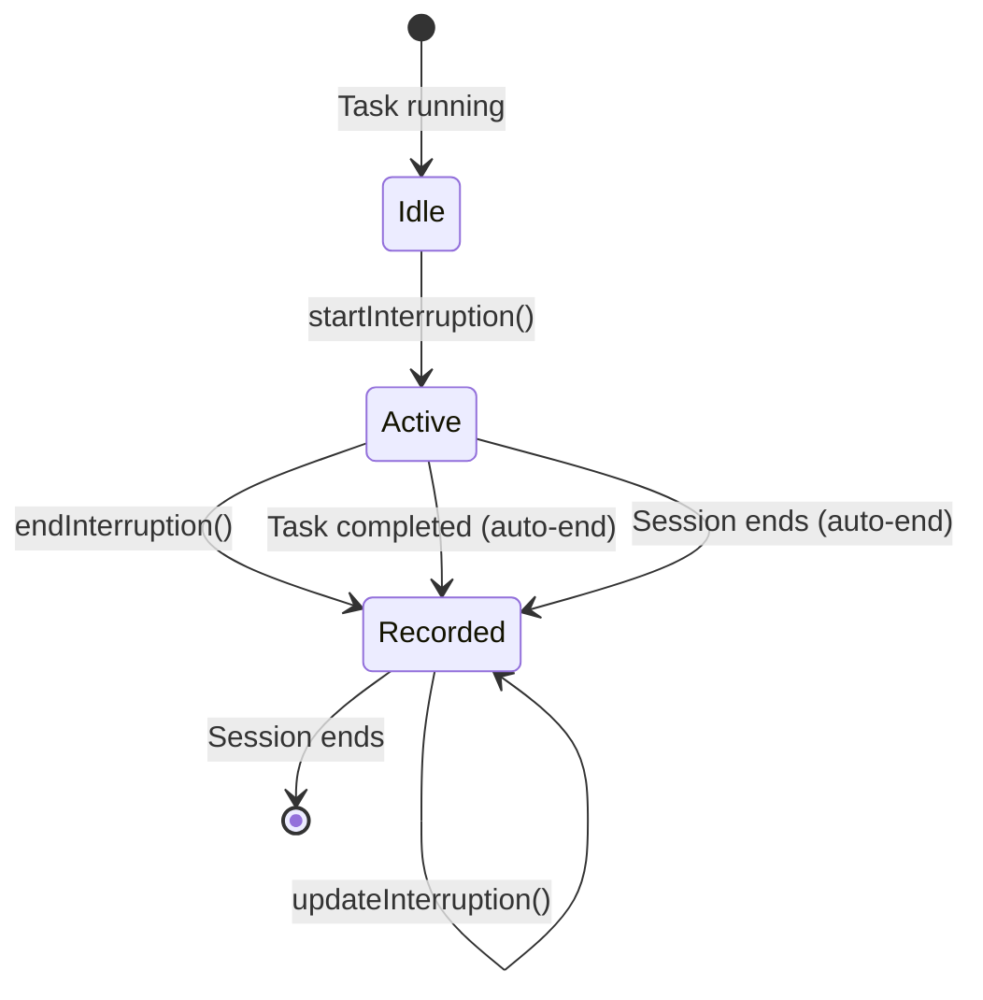

# Data Model: Interruption Tracking

**Feature**: 004-interruption-tracking
**Date**: 2025-12-19

## Overview

This document defines the data structures for interruption tracking, extending the existing type system in `src/lib/types/index.ts`.

## New Types

### InterruptionCategory

```typescript
/**
 * Category for classifying interruptions
 */
export type InterruptionCategory = 'Phone' | 'Luci' | 'Colleague' | 'Personal' | 'Other';
```

### Interruption

```typescript
/**
 * A single interruption event during task execution.
 * Created when user clicks "Interrupt", finalized on "Resume".
 */
export interface Interruption {
  /** Unique identifier (UUID v4) */
  interruptionId: string;

  /** Reference to the task that was interrupted */
  taskId: string;

  /** When the interruption started (ISO 8601 string) */
  startedAt: string;

  /** When the interruption ended (ISO 8601 string), null if ongoing */
  endedAt: string | null;

  /** Duration in seconds (calculated on end), 0 if ongoing */
  durationSec: number;

  /** Optional category selected by user */
  category: InterruptionCategory | null;

  /** Optional note added by user (max 200 chars) */
  note: string | null;
}
```

### InterruptionSummary

```typescript
/**
 * Aggregated interruption data for a single task.
 * Computed at runtime from Interruption[].
 */
export interface InterruptionSummary {
  /** Reference to task */
  taskId: string;

  /** Total number of interruptions for this task */
  count: number;

  /** Total interruption time in seconds */
  totalDurationSec: number;
}
```

### InterruptionState

```typescript
/**
 * Runtime state for the interruption store.
 * Manages active interruption and history.
 */
export interface InterruptionState {
  /** Whether an interruption is currently active */
  isInterrupted: boolean;

  /** The currently active interruption, null if not interrupted */
  activeInterruption: Interruption | null;

  /** Elapsed milliseconds on current interruption (for display) */
  elapsedMs: number;

  /** All interruptions for the current session */
  interruptions: Interruption[];
}
```

## Constants

```typescript
/** localStorage key for interruptions */
export const STORAGE_KEY_INTERRUPTIONS = 'tm_interruptions';

/** Maximum note length */
export const MAX_INTERRUPTION_NOTE_LENGTH = 200;

/** Interruption categories for UI iteration */
export const INTERRUPTION_CATEGORIES: InterruptionCategory[] = [
  'Phone',
  'Luci',
  'Colleague',
  'Personal',
  'Other'
];
```

## Entity Relationships



## State Transitions

### Interruption Lifecycle



### State Values

| State | isInterrupted | activeInterruption | Task Timer |
|-------|---------------|-------------------|------------|
| Idle | false | null | Running |
| Active | true | Interruption object | Paused |
| Recorded | false | null | Running |

## Storage Schema

### localStorage: `tm_interruptions`

```typescript
// Stored as JSON array
type StoredInterruptions = Interruption[];

// Example:
[
  {
    "interruptionId": "a1b2c3d4-...",
    "taskId": "task-1",
    "startedAt": "2025-12-19T10:30:00.000Z",
    "endedAt": "2025-12-19T10:35:00.000Z",
    "durationSec": 300,
    "category": "Phone",
    "note": "Quick call from client"
  }
]
```

### Schema Version

Increment `CURRENT_SCHEMA_VERSION` from 2 to 3.

Migration v2→v3:
- Add `tm_interruptions` key (initialize as empty array if missing)
- No data transformation needed for existing keys

## Validation Rules

### Interruption

| Field | Rule |
|-------|------|
| interruptionId | Required, UUID v4 format |
| taskId | Required, must reference valid ConfirmedTask |
| startedAt | Required, valid ISO 8601 string |
| endedAt | Null while active, valid ISO 8601 when ended |
| durationSec | 0 while active, positive integer when ended |
| category | Null or one of InterruptionCategory values |
| note | Null or string, max 200 characters |

### Business Rules

1. Cannot start interruption when no task is active
2. Cannot start interruption when already interrupted
3. Cannot end interruption when not interrupted
4. Auto-end interruption before task completion
5. Auto-end interruption before session end
6. Category and note can be updated after recording

## Computed Values

### InterruptionSummary (per task)

```typescript
function computeSummary(interruptions: Interruption[], taskId: string): InterruptionSummary {
  const taskInterruptions = interruptions.filter(i => i.taskId === taskId && i.endedAt !== null);
  return {
    taskId,
    count: taskInterruptions.length,
    totalDurationSec: taskInterruptions.reduce((sum, i) => sum + i.durationSec, 0)
  };
}
```

### Formatted Duration

```typescript
function formatInterruptionTime(seconds: number): string {
  const minutes = Math.floor(seconds / 60);
  const secs = seconds % 60;
  if (minutes === 0) return `${secs}s`;
  return `${minutes}m ${secs}s`;
}
```

## Integration Points

### With sessionStore

- Clear interruptions when session resets
- Auto-end active interruption on task/session completion
- Restore interruption state on session recovery

### With timerStore

- Pause task timer on startInterruption()
- Resume task timer on endInterruption()
- Track elapsed interruption time separately

### With storage service

- Add saveInterruptions() method
- Add loadInterruptions() method
- Add clearInterruptions() method
- Update schema migration logic
