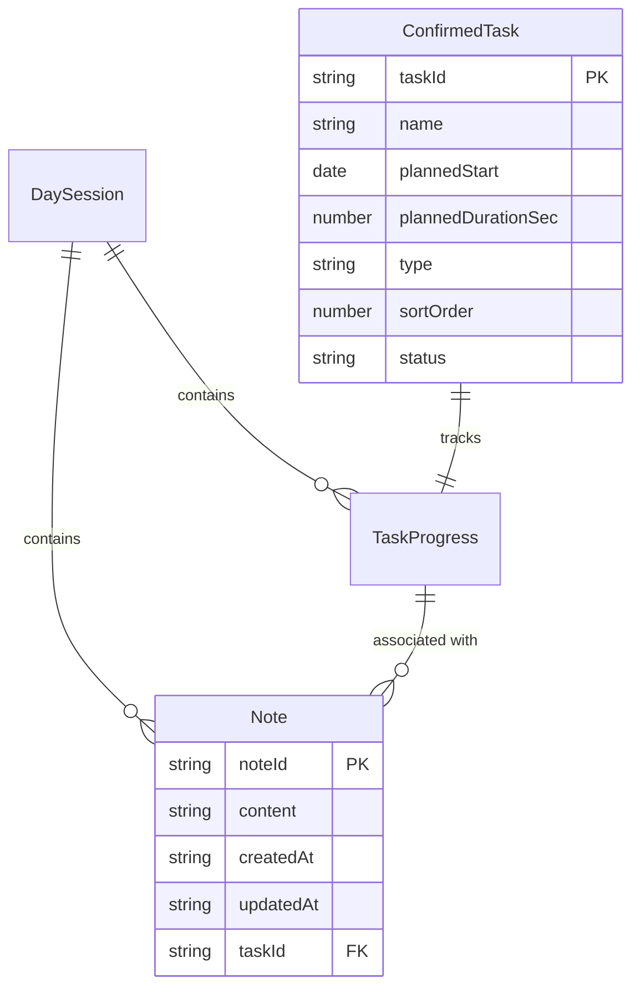
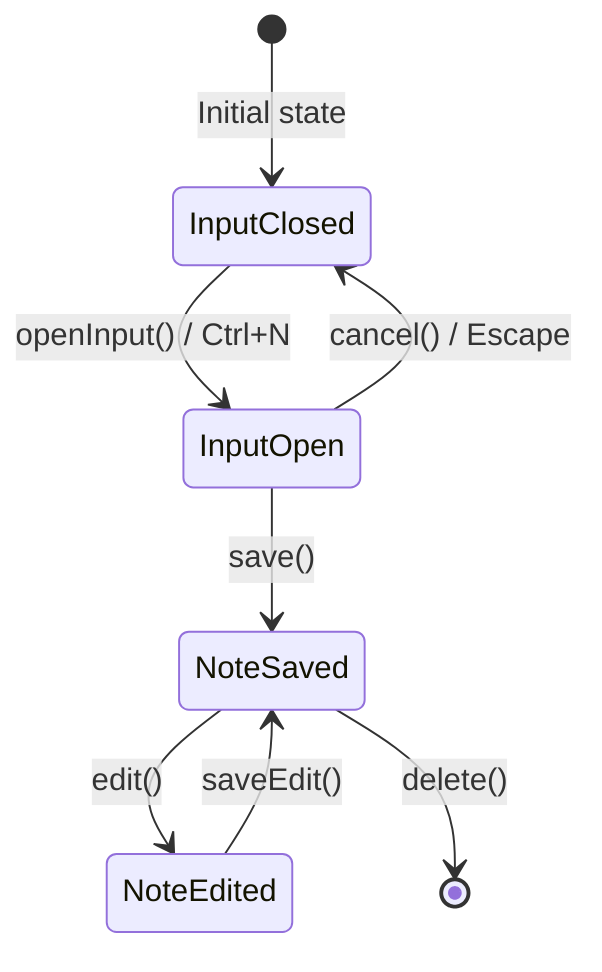
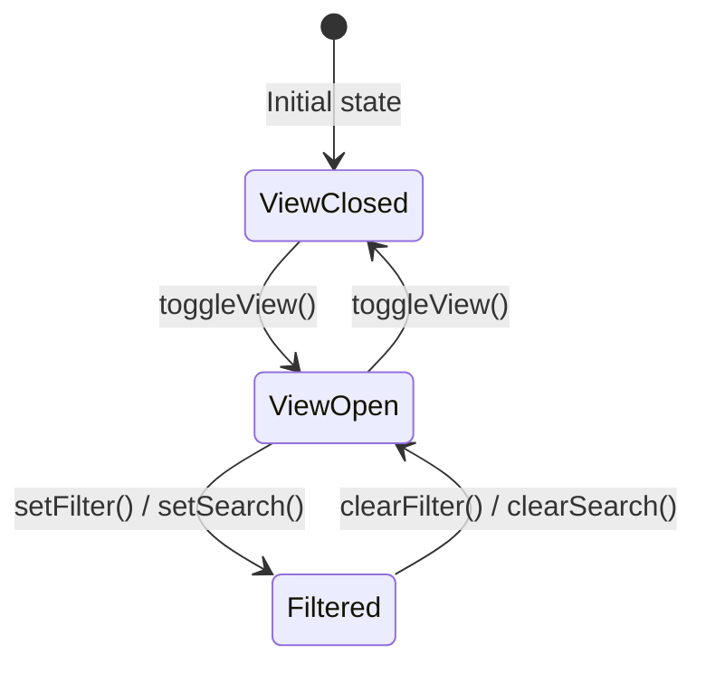

# Data Model: Note Capture

**Feature**: 005-note-capture
**Date**: 2025-12-19

## Overview

This document defines the data structures for note capture, extending the existing type system in `src/lib/types/index.ts`.

## New Types

### Note

```typescript
/**
 * A quick note captured during task execution.
 * Created when user saves a note, can be edited after creation.
 */
export interface Note {
  /** Unique identifier (UUID v4) */
  noteId: string;

  /** Note content (max 500 characters) */
  content: string;

  /** When the note was created (ISO 8601 string) */
  createdAt: string;

  /** When the note was last updated (ISO 8601 string), null if never edited */
  updatedAt: string | null;

  /** Reference to the task during which note was created, null if no active task */
  taskId: string | null;
}
```

### NoteState

```typescript
/**
 * Runtime state for the note store.
 * Manages notes and UI state.
 */
export interface NoteState {
  /** All notes for the current session */
  notes: Note[];

  /** Whether the note input is currently open */
  isInputOpen: boolean;

  /** Whether the notes view panel is open */
  isViewOpen: boolean;

  /** Current search query in notes view */
  searchQuery: string;

  /** Current task filter in notes view (null = all notes) */
  taskFilter: string | null;
}
```

## Constants

```typescript
/** localStorage key for notes */
export const STORAGE_KEY_NOTES = 'tm_notes';

/** Maximum note content length */
export const MAX_NOTE_LENGTH = 500;

/** Character count thresholds for visual feedback */
export const NOTE_CHAR_WARNING_THRESHOLD = 50;  // Yellow at 50 remaining
export const NOTE_CHAR_DANGER_THRESHOLD = 10;   // Red at 10 remaining
```

## Entity Relationships



## State Transitions

### Note Lifecycle



### Notes View State



## Storage Schema

### localStorage: `tm_notes`

```typescript
// Stored as JSON array
type StoredNotes = Note[];

// Example:
[
  {
    "noteId": "n1b2c3d4-...",
    "content": "Call back John at 555-1234",
    "createdAt": "2025-12-19T10:30:00.000Z",
    "updatedAt": null,
    "taskId": "task-1"
  },
  {
    "noteId": "n2c3d4e5-...",
    "content": "Remember to check email after this task",
    "createdAt": "2025-12-19T10:45:00.000Z",
    "updatedAt": "2025-12-19T10:46:00.000Z",
    "taskId": null
  }
]
```

### Schema Version

Increment `CURRENT_SCHEMA_VERSION` from 3 to 4.

Migration v3→v4:
- Add `tm_notes` key (initialize as empty array if missing)
- No data transformation needed for existing keys

## Validation Rules

### Note

| Field | Rule |
|-------|------|
| noteId | Required, UUID v4 format |
| content | Required, 1-500 characters, whitespace-trimmed |
| createdAt | Required, valid ISO 8601 string |
| updatedAt | Null or valid ISO 8601 string |
| taskId | Null or valid ConfirmedTask.taskId reference |

### Business Rules

1. Cannot save empty note (whitespace-only content rejected)
2. Content trimmed before save
3. taskId auto-populated from active task at creation time
4. taskId remains unchanged even if task completes
5. Note can be edited/deleted at any time
6. Deletion is permanent (no soft delete)

## Computed Values

### Filtered Notes

```typescript
function filterNotes(
  notes: Note[],
  searchQuery: string,
  taskFilter: string | null
): Note[] {
  let result = notes;

  // Apply search filter (case-insensitive substring match)
  if (searchQuery.trim()) {
    const query = searchQuery.toLowerCase();
    result = result.filter(n => n.content.toLowerCase().includes(query));
  }

  // Apply task filter
  if (taskFilter !== null) {
    result = result.filter(n => n.taskId === taskFilter);
  }

  // Sort by createdAt descending (newest first)
  return result.sort((a, b) =>
    new Date(b.createdAt).getTime() - new Date(a.createdAt).getTime()
  );
}
```

### Notes by Task

```typescript
function getNotesByTask(notes: Note[], taskId: string): Note[] {
  return notes
    .filter(n => n.taskId === taskId)
    .sort((a, b) =>
      new Date(b.createdAt).getTime() - new Date(a.createdAt).getTime()
    );
}
```

### General Notes (no task association)

```typescript
function getGeneralNotes(notes: Note[]): Note[] {
  return notes
    .filter(n => n.taskId === null)
    .sort((a, b) =>
      new Date(b.createdAt).getTime() - new Date(a.createdAt).getTime()
    );
}
```

### Relative Time Display

```typescript
function formatRelativeTime(isoString: string): string {
  const date = new Date(isoString);
  const now = new Date();
  const diffMs = now.getTime() - date.getTime();
  const diffMin = Math.floor(diffMs / 60000);
  const diffHours = Math.floor(diffMs / 3600000);

  if (diffMin < 1) return 'Just now';
  if (diffMin < 60) return `${diffMin} min ago`;

  const isToday = date.toDateString() === now.toDateString();
  const yesterday = new Date(now);
  yesterday.setDate(yesterday.getDate() - 1);
  const isYesterday = date.toDateString() === yesterday.toDateString();

  const timeStr = date.toLocaleTimeString([], { hour: '2-digit', minute: '2-digit' });

  if (isToday) return `Today ${timeStr}`;
  if (isYesterday) return `Yesterday ${timeStr}`;

  return date.toLocaleDateString([], { month: 'short', day: 'numeric' }) + ' ' + timeStr;
}
```

### Character Counter State

```typescript
function getCharCountState(content: string): { remaining: number; color: 'gray' | 'yellow' | 'red' } {
  const remaining = MAX_NOTE_LENGTH - content.length;

  if (remaining < NOTE_CHAR_DANGER_THRESHOLD) return { remaining, color: 'red' };
  if (remaining < NOTE_CHAR_WARNING_THRESHOLD) return { remaining, color: 'yellow' };
  return { remaining, color: 'gray' };
}
```

## Integration Points

### With sessionStore

- Read `currentProgress?.taskId` for auto-association on note creation
- Clear notes when `sessionStore.reset()` is called (optional - TBD if notes survive session reset)

### With storage service

- Add `saveNotes(notes: Note[]): boolean` method
- Add `loadNotes(): Note[]` method
- Add `clearNotes(): boolean` method
- Update schema migration logic (v3→v4)

### With +page.svelte

- Add keyboard listener for Ctrl/Cmd+N shortcut
- Render NoteInput conditionally based on `noteStore.isInputOpen`
- Add Notes toggle button to access `noteStore.toggleView()`
- Render NotesView panel based on `noteStore.isViewOpen`

## Store API

### noteStore Methods

```typescript
interface NoteStore {
  // State getters
  readonly notes: Note[];
  readonly isInputOpen: boolean;
  readonly isViewOpen: boolean;
  readonly searchQuery: string;
  readonly taskFilter: string | null;

  // Derived getters
  readonly filteredNotes: Note[];

  // Input actions
  openInput(): void;
  closeInput(): void;

  // Note CRUD
  addNote(content: string, taskId: string | null): Note;
  updateNote(noteId: string, content: string): void;
  deleteNote(noteId: string): void;

  // View actions
  toggleView(): void;
  setSearchQuery(query: string): void;
  setTaskFilter(taskId: string | null): void;
  clearFilters(): void;

  // Lifecycle
  restore(saved: Note[]): void;
  reset(): void;
}
```
