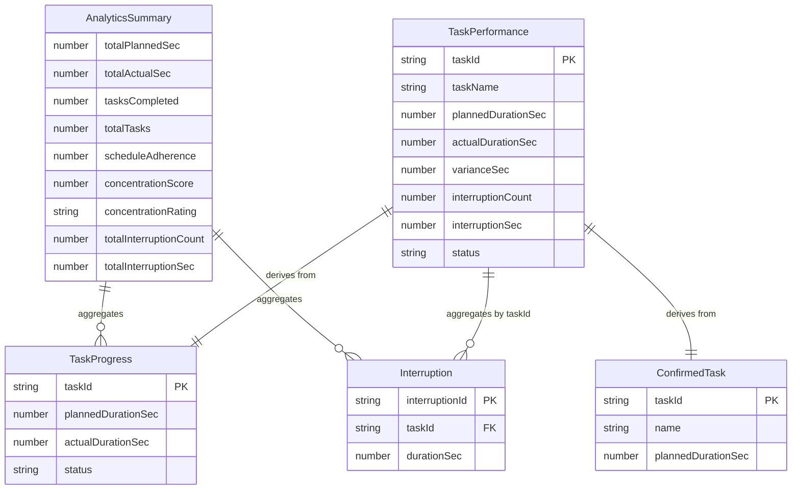
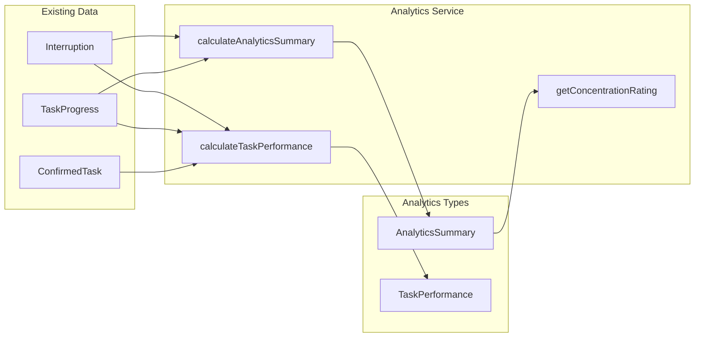

# Data Model: Analytics Dashboard

**Feature**: 006-analytics-dashboard
**Date**: 2025-12-19

## Overview

Analytics data model defines types for calculated metrics. All types are runtime-only (not persisted) and derived from existing session and interruption data.

---

## Type Definitions

### ConcentrationRating

Classification of concentration score into human-readable tiers.

```typescript
/**
 * Rating tier for concentration score
 */
export type ConcentrationRating = 'Excellent' | 'Good' | 'Fair' | 'Needs improvement';
```

**Thresholds**:
| Score Range | Rating |
|-------------|--------|
| ≥ 90% | Excellent |
| 80-89% | Good |
| 70-79% | Fair |
| < 70% | Needs improvement |

---

### AnalyticsSummary

Aggregated metrics for the entire work session.

```typescript
/**
 * Day-level analytics summary
 * Computed from sessionStore and interruptionStore data
 */
export interface AnalyticsSummary {
  /** Total planned time across all tasks (seconds) */
  totalPlannedSec: number;

  /** Total actual time spent on tasks (seconds) */
  totalActualSec: number;

  /** Number of completed tasks */
  tasksCompleted: number;

  /** Total number of tasks in schedule */
  totalTasks: number;

  /** Schedule adherence percentage (planned/actual × 100) */
  scheduleAdherence: number;

  /** Concentration score percentage (0-100) */
  concentrationScore: number;

  /** Human-readable concentration rating */
  concentrationRating: ConcentrationRating;

  /** Total number of interruptions across all tasks */
  totalInterruptionCount: number;

  /** Total interruption time across all tasks (seconds) */
  totalInterruptionSec: number;
}
```

**Relationships**:
- Derived from `TaskProgress[]` (sessionStore)
- Derived from `Interruption[]` (interruptionStore)

**Computation Rules**:
```
totalPlannedSec = Σ taskProgress.plannedDurationSec
totalActualSec = Σ taskProgress.actualDurationSec (where status = 'complete')
tasksCompleted = count(taskProgress where status = 'complete')
totalTasks = taskProgress.length
scheduleAdherence = (totalPlannedSec / totalActualSec) × 100 (or 0 if totalActualSec = 0)
concentrationScore = ((totalActualSec - totalInterruptionSec) / totalActualSec) × 100 (or 0 if totalActualSec = 0)
totalInterruptionCount = interruptions.length
totalInterruptionSec = Σ interruption.durationSec
```

---

### TaskPerformance

Per-task performance metrics for detailed analysis.

```typescript
/**
 * Performance metrics for a single task
 * Computed by joining task, progress, and interruption data
 */
export interface TaskPerformance {
  /** Task identifier (from ConfirmedTask) */
  taskId: string;

  /** Task name for display */
  taskName: string;

  /** Planned duration (seconds) */
  plannedDurationSec: number;

  /** Actual duration (seconds), 0 if not complete */
  actualDurationSec: number;

  /** Variance: actual - planned (positive = over, negative = under) */
  varianceSec: number;

  /** Number of interruptions during this task */
  interruptionCount: number;

  /** Total interruption time for this task (seconds) */
  interruptionSec: number;

  /** Task completion status */
  status: ProgressStatus;
}
```

**Relationships**:
- `taskId` references `ConfirmedTask.taskId`
- `taskName` from `ConfirmedTask.name`
- `plannedDurationSec`, `actualDurationSec`, `status` from `TaskProgress`
- `interruptionCount`, `interruptionSec` aggregated from `Interruption[]` where `taskId` matches

**Computation Rules**:
```
varianceSec = actualDurationSec - plannedDurationSec
interruptionCount = count(interruptions where taskId = this.taskId)
interruptionSec = Σ interruption.durationSec (where taskId = this.taskId)
```

---

## Constants

```typescript
/** Concentration score thresholds */
export const CONCENTRATION_EXCELLENT_THRESHOLD = 90;
export const CONCENTRATION_GOOD_THRESHOLD = 80;
export const CONCENTRATION_FAIR_THRESHOLD = 70;
```

---

## Entity Relationship Diagram



---

## Data Flow



---

## Validation Rules

### AnalyticsSummary

| Field | Validation | Default |
|-------|------------|---------|
| totalPlannedSec | ≥ 0 | 0 |
| totalActualSec | ≥ 0 | 0 |
| tasksCompleted | 0 ≤ x ≤ totalTasks | 0 |
| scheduleAdherence | ≥ 0 (no upper bound) | 0 |
| concentrationScore | 0 ≤ x ≤ 100 | 0 |

### TaskPerformance

| Field | Validation | Default |
|-------|------------|---------|
| plannedDurationSec | ≥ 0 | 0 |
| actualDurationSec | ≥ 0 | 0 |
| varianceSec | any integer | 0 |
| interruptionCount | ≥ 0 | 0 |
| interruptionSec | ≥ 0 | 0 |

---

## Storage

**No new localStorage keys required.**

All analytics types are computed at runtime from existing persisted data:
- `tm_session` → TaskProgress[]
- `tm_tasks` → ConfirmedTask[]
- `tm_interruptions` → Interruption[]

Analytics are ephemeral and recalculated on each view.
