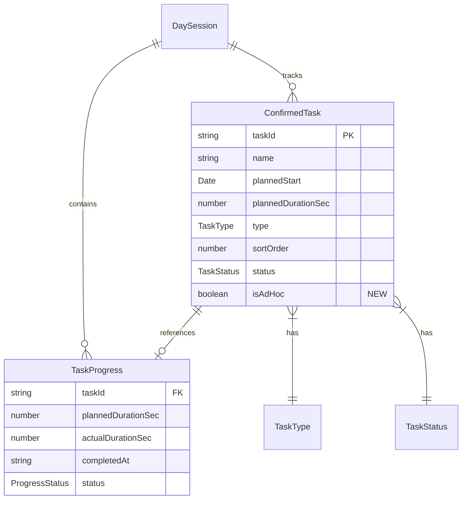

# Data Model: Ad-Hoc Task Creation

**Feature**: 009-ad-hoc-tasks
**Date**: 2025-12-20

## Entity Changes

### ConfirmedTask (Modified)

Extends existing `ConfirmedTask` interface with optional `isAdHoc` flag.

```typescript
/**
 * A task after schedule confirmation.
 * Persisted to localStorage.
 */
export interface ConfirmedTask {
  /** Unique identifier (preserved from DraftTask.id) */
  taskId: string;

  /** Task name (editable) */
  name: string;

  /** Planned start time */
  plannedStart: Date;

  /** Planned duration in seconds */
  plannedDurationSec: number;

  /** Fixed or flexible */
  type: TaskType;

  /** Execution order (final order from preview) */
  sortOrder: number;

  /** Completion state */
  status: TaskStatus;

  /** NEW: True if task was created during session (ad-hoc), false/undefined if imported */
  isAdHoc?: boolean;
}
```

**Field Details**:

| Field | Type | Required | Default | Validation |
|-------|------|----------|---------|------------|
| `isAdHoc` | `boolean` | No | `undefined` (treated as false) | N/A |

**State Transitions**: None (flag is immutable after task creation)

### SerializedTask (Modified - Internal)

Storage serialization format in `storage.ts`.

```typescript
interface SerializedTask {
  taskId: string;
  name: string;
  plannedStart: string; // ISO 8601
  plannedDurationSec: number;
  type: 'fixed' | 'flexible';
  sortOrder: number;
  status: 'pending' | 'active' | 'complete';
  isAdHoc?: boolean;  // NEW: Optional for backward compatibility
}
```

### AddTaskInput (New - Internal)

Input type for `sessionStore.addTask()` method.

```typescript
/**
 * Input for creating an ad-hoc task.
 * Used by AddTaskDialog component.
 */
interface AddTaskInput {
  /** Task name (1-200 characters) */
  name: string;

  /** Duration in seconds (1-86400) */
  durationSec: number;

  /** Task type */
  type: TaskType;

  /** Start time (required for fixed tasks, optional for flexible) */
  startTime?: Date;
}
```

**Validation Rules**:
- `name`: Required, trimmed, 1-200 characters
- `durationSec`: Required, > 0, ≤ 86400 (MAX_DURATION_SECONDS)
- `type`: Required, 'fixed' | 'flexible'
- `startTime`: Required when `type === 'fixed'`

## Relationship Diagram



## Analytics Impact

### AnalyticsSummary (Extended Computation)

Computed fields for planned vs. ad-hoc task breakdown:

```typescript
interface AnalyticsSummary {
  // ... existing fields

  /** Number of tasks imported from file */
  importedTaskCount?: number;

  /** Number of ad-hoc tasks created during session */
  adHocTaskCount?: number;
}
```

**Computation Logic**:
```typescript
const adHocTaskCount = tasks.filter(t => t.isAdHoc === true).length;
const importedTaskCount = tasks.filter(t => !t.isAdHoc).length;
```

## Export Impact

### TaskExportRow (Modified)

Add source indicator column for exports:

```typescript
interface TaskExportRow {
  // ... existing fields

  /** Task source: 'Imported' or 'Ad-Hoc' */
  source: string;
}
```

**Column Mapping**:
| Export Column | Value |
|---------------|-------|
| `source` | `task.isAdHoc ? 'Ad-Hoc' : 'Imported'` |

## Storage Schema

### Backward Compatibility

- **No schema version bump required**: `isAdHoc` is an optional field
- **Existing data**: Tasks without `isAdHoc` field are treated as imported (false)
- **Serialization**: Only include `isAdHoc` in output if true (minimize storage)

### Migration Path

```typescript
// No migration function needed
// Deserialization handles missing field automatically:
function deserializeTask(data: SerializedTask): ConfirmedTask {
  return {
    taskId: data.taskId,
    name: data.name,
    plannedStart: new Date(data.plannedStart),
    plannedDurationSec: data.plannedDurationSec,
    type: data.type,
    sortOrder: data.sortOrder,
    status: data.status,
    isAdHoc: data.isAdHoc // undefined if not present
  };
}
```

## Validation Rules Summary

| Entity | Field | Rule | Error Message |
|--------|-------|------|---------------|
| AddTaskInput | name | Required, 1-200 chars | "Task name is required" |
| AddTaskInput | name | Trimmed non-empty | "Task name cannot be blank" |
| AddTaskInput | durationSec | > 0 | "Duration must be positive" |
| AddTaskInput | durationSec | ≤ 86400 | "Duration cannot exceed 24 hours" |
| AddTaskInput | type | 'fixed' \| 'flexible' | "Invalid task type" |
| AddTaskInput | startTime | Required if fixed | "Start time required for fixed tasks" |
| AddTaskInput | startTime | Valid Date | "Invalid start time" |

## Warning Conditions (Non-Blocking)

| Condition | Warning Message |
|-----------|----------------|
| Fixed task with past start time | "This task's scheduled time has already passed" |
| Fixed task overlaps existing fixed | "This task overlaps with {taskName} at {time}" |

## Constants

No new constants required. Existing constants used:
- `MAX_TASK_NAME_LENGTH = 200`
- `MAX_DURATION_SECONDS = 86400`
