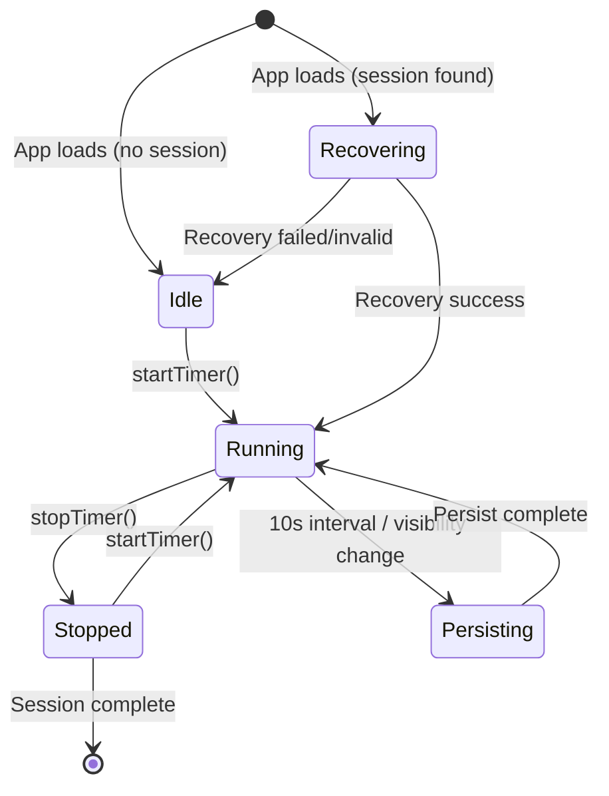

# Data Model: Timer Persistence Across Browser/System Interruptions

**Feature**: 010-timer-persistence
**Date**: 2025-12-21

## Entity Changes

### Modified: DaySession

Add new field to track when the timer for the current task was started (wall-clock time).

```typescript
interface DaySession {
  // ... existing fields ...

  /**
   * Wall-clock timestamp (epoch ms) when the current task timer was started.
   * Used for recovery calculation: elapsed = (now - timerStartedAtMs) + elapsedOffset
   *
   * @new 010-timer-persistence
   */
  timerStartedAtMs: number;
}
```

**Field Details**:
| Field | Type | Nullable | Default | Constraints |
|-------|------|----------|---------|-------------|
| `timerStartedAtMs` | `number` | No | `Date.now()` | Must be ≤ `Date.now()` on recovery |

**Lifecycle**:
- Set when `timerStore.start()` is called
- Updated when timer is restarted (e.g., after task completion)
- Used during recovery to calculate elapsed time

### Modified: DaySession (existing fields used for persistence)

Existing fields that support timer persistence (no changes needed):

| Field | Usage for Persistence |
|-------|----------------------|
| `currentTaskElapsedMs` | Stores elapsed time at last sync (offset for recovery) |
| `lastPersistedAt` | Timestamp of last sync (used to calculate time gap) |
| `status` | If `'running'`, session was active when browser closed |

### New Type: TimerPersistenceState

Runtime state for timer recovery (not persisted directly, derived during recovery).

```typescript
/**
 * Timer recovery state calculated on app mount.
 * Not persisted - computed from DaySession fields.
 *
 * @new 010-timer-persistence
 */
interface TimerRecoveryResult {
  /** Whether recovery was successful */
  success: boolean;

  /** Calculated elapsed time in milliseconds */
  recoveredElapsedMs: number;

  /** Time spent away from app (for logging/debugging) */
  awayTimeMs: number;

  /** Whether timestamp validation passed */
  isValid: boolean;

  /** Error message if recovery failed */
  error?: string;
}
```

### Existing: Interruption (no changes needed)

The `Interruption` type already supports recovery:

| Field | Usage for Persistence |
|-------|----------------------|
| `startedAt` | ISO timestamp when interruption started (used for elapsed calculation) |
| `endedAt` | If `null`, interruption was active when browser closed |
| `durationSec` | Set when interruption ends (not used for recovery) |

**Recovery Calculation**:
```typescript
const elapsedMs = Date.now() - new Date(interruption.startedAt).getTime();
```

## State Transitions

### Timer State Machine



### Persistence Trigger Events

| Event | Action | Notes |
|-------|--------|-------|
| Timer start | Save initial state | Set `timerStartedAtMs` |
| 10-second interval | Save current elapsed | Update `currentTaskElapsedMs`, `lastPersistedAt` |
| `visibilitychange` (hidden) | Save current elapsed | Immediate persist |
| `pagehide` | Save current elapsed | Immediate persist |
| `beforeunload` | Save current elapsed | Immediate persist |
| Timer stop | Save final elapsed | Clear `timerStartedAtMs` |
| Task complete | Save + advance | Move to next task |

## Storage Schema

### Schema Version Change

Increment from v5 to v6 for timer persistence fields.

```typescript
export const CURRENT_SCHEMA_VERSION = 6;
```

### Migration: v5 → v6

```typescript
function migrateV5toV6(): void {
  try {
    const session = localStorage.getItem(STORAGE_KEY_SESSION);
    if (session) {
      const parsed = JSON.parse(session) as DaySession;
      // Add timerStartedAtMs if missing (use lastPersistedAt as fallback)
      if (parsed.timerStartedAtMs === undefined) {
        parsed.timerStartedAtMs = parsed.lastPersistedAt || Date.now();
        localStorage.setItem(STORAGE_KEY_SESSION, JSON.stringify(parsed));
      }
    }
  } catch {
    // Ignore errors during migration
  }
}
```

## Validation Rules

### Recovery Validation

| Check | Condition | Action |
|-------|-----------|--------|
| Future timestamp | `lastPersistedAt > Date.now()` | Reset timer, log warning |
| Negative elapsed | `calculatedElapsed < 0` | Use 0 |
| Excessive elapsed | `calculatedElapsed > 24h` | Cap at 24h, log warning |
| Missing required field | `timerStartedAtMs === undefined` | Use migration fallback |

### Persistence Validation

| Check | Condition | Action |
|-------|-----------|--------|
| localStorage available | `isLocalStorageAvailable()` | Skip persist if false |
| Session exists | `session !== null` | Only persist if running |
| Timer running | `isRunning === true` | Only persist active timers |

## Constants

### New Constants

```typescript
/**
 * How often to sync timer state to localStorage (ms)
 * Per clarification: Every 10 seconds
 *
 * @new 010-timer-persistence
 */
export const TIMER_SYNC_INTERVAL_MS = 10000;

/**
 * Maximum reasonable elapsed time for recovery (24 hours in ms)
 * Used for validation bounds checking
 *
 * @new 010-timer-persistence
 */
export const MAX_RECOVERY_ELAPSED_MS = 24 * 60 * 60 * 1000;
```

### Existing Constants (referenced)

| Constant | Value | Usage |
|----------|-------|-------|
| `STORAGE_KEY_SESSION` | `'tm_session'` | Session storage key |
| `STORAGE_KEY_INTERRUPTIONS` | `'tm_interruptions'` | Interruption storage key |

## API Changes

### Storage Service Additions

```typescript
// New methods added to storage service

/**
 * Save timer state for persistence.
 * Called every 10 seconds and on browser events.
 */
saveTimerState(state: { elapsedMs: number; timerStartedAtMs: number }): boolean;

/**
 * Load timer state for recovery.
 * Returns null if no active timer found.
 */
loadTimerState(): { elapsedMs: number; timerStartedAtMs: number; lastPersistedAt: number } | null;
```

### TimerStore Additions

```typescript
// New methods added to timerStore

/**
 * Recover timer state on app load.
 * Calculates elapsed time from persisted timestamps.
 *
 * @returns TimerRecoveryResult with success status and recovered elapsed
 */
recover(): TimerRecoveryResult;

/**
 * Start periodic sync interval.
 * Called internally when timer starts.
 */
startPersistenceSync(): void;

/**
 * Stop periodic sync interval.
 * Called internally when timer stops.
 */
stopPersistenceSync(): void;
```

### InterruptionStore (no API changes)

The existing `restore()` method already handles recovery via wall-clock calculation from `startedAt`. No changes needed.
