# Time Micromanager — Technical Architecture

---

## 1. Architecture Overview

The Time Micromanager is a **client-side single-page application (SPA)** that runs entirely in the browser with no backend dependencies. This architecture ensures privacy, offline capability, and zero infrastructure costs.

### 1.1 Design Principles

| Principle | Implementation |
|-----------|----------------|
| **Offline-First** | All data stored in browser localStorage; no network required |
| **Privacy-Focused** | Data never leaves the user's device unless explicitly exported |
| **Responsive** | Mobile-first CSS with breakpoints for tablet and desktop |
| **Zero Dependencies** | Minimal external libraries; vanilla JS or lightweight framework |
| **Data Portability** | Standard Excel/CSV export for external analysis |

---

## 2. System Architecture Diagram

```mermaid
flowchart TB
    subgraph UserInterface["🖥️ User Interface Layer"]
        direction TB
        UI_Main["Main Dashboard<br/>• Active Timer Display<br/>• Current Task Info<br/>• Lag Indicator"]
        UI_Schedule["Schedule View<br/>• Task List<br/>• Fixed/Flexible Badges<br/>• Progress Status"]
        UI_Notes["Notes Panel<br/>• Quick Capture<br/>• Note List<br/>• Edit/Delete"]
        UI_Analytics["Analytics Dashboard<br/>• Concentration Score<br/>• Efficiency Metrics<br/>• Task Performance"]
        UI_Settings["Settings<br/>• Themes<br/>• Alerts Config<br/>• Preferences"]
    end

    subgraph CoreEngine["⚙️ Core Application Engine"]
        direction TB
        TM["Timer Manager<br/>• Countdown Logic<br/>• Overrun Detection<br/>• State Transitions"]
        SM["Schedule Manager<br/>• Task Queue<br/>• Lag Calculation<br/>• Collision Detection"]
        IM["Interruption Manager<br/>• Pause/Resume<br/>• Duration Tracking<br/>• Aggregation"]
        NM["Notes Manager<br/>• CRUD Operations<br/>• Task Association<br/>• Search/Filter"]
        AM["Analytics Manager<br/>• Score Calculation<br/>• Metrics Aggregation<br/>• Performance Analysis"]
    end

    subgraph DataLayer["💾 Data Layer"]
        direction TB
        LS[("Local Storage<br/>(Browser)")] 
        SM_State["Session State<br/>• Active Task<br/>• Timer Value<br/>• Interruption State"]
        SM_Tasks["Task Data<br/>• Imported Schedule<br/>• Actual Times<br/>• Completion Status"]
        SM_Int["Interruption Log<br/>• Timestamps<br/>• Durations<br/>• Categories"]
        SM_Notes["Notes Store<br/>• Content<br/>• Timestamps<br/>• Associations"]
    end

    subgraph IOLayer["📁 Import/Export Layer"]
        direction TB
        Parser["File Parser<br/>• XLSX Parser<br/>• CSV Parser<br/>• Validation"]
        Exporter["Data Exporter<br/>• Excel Generator<br/>• CSV Generator<br/>• Report Builder"]
    end

    subgraph External["📄 External Files"]
        direction TB
        Import[/"Import File<br/>.xlsx / .csv"/]
        Export[/"Export File<br/>.xlsx / .csv"/]
    end

    UI_Main <--> TM
    UI_Main <--> IM
    UI_Schedule <--> SM
    UI_Notes <--> NM
    UI_Analytics <--> AM
    UI_Settings --> CoreEngine

    TM <--> SM
    TM <--> IM
    SM --> AM
    IM --> AM
    NM --> AM

    TM <--> SM_State
    SM <--> SM_Tasks
    IM <--> SM_Int
    NM <--> SM_Notes
    SM_State --> LS
    SM_Tasks --> LS
    SM_Int --> LS
    SM_Notes --> LS

    Parser --> SM
    AM --> Exporter
    SM_Tasks --> Exporter
    SM_Int --> Exporter
    SM_Notes --> Exporter

    Import --> Parser
    Exporter --> Export
```



[🎨 Edit Architecture Diagram](https://mermaidchart.com/play?utm_source=mermaid_mcp_server&utm_medium=remote_server&utm_campaign=claude#pako:eNqVVtFqIzcU_RXhZWEXJmuz2STesCzYnqQYPEk2k4SFeAmK5nosIo-MpEkcSqGFvhdaKLQvhUL_oU_9mP2B9hMqaWY0mpk0mzoPtq5G59x77tGdfN0jPIHefm_B-B1ZYqHQ2XieIf2R-XUq8HqJziWIaaZALDCBy3nvn99-_uPvP3-wceQ20Azfg5j3PhWnzSehAoiiPHOY5nM-vYowzTSQ-UIhlstrjkXy7lr033_-9nc00mduAZ3RlcYPqVwzfO82J7kQkOkssbzR5AvudmY41YGEEqx4Mw_NGJMlJDkz6Vc_0QWFO3fa4s2oVC5ySDeQ9A8ZbOi1fnqMkxSk2z0RPBUgJYoVVrls8x1xBVKT2W90gjNg7uiHnJIbNMFrlQtwUfNkM4GDhKp-CAwUtOFHGWb3ihJD4X4_IOWEZ0SrJbDtQky4R3iwWFBCISP3KAIlNEBTjBPdVy5WWCN01ASlaJYa9upnfXYJK0-nEQOhpElkQVNPPViA7iOBWjnIknnWst5EJ3yQpTQzjfv86y_GdiaGRus1M502ZRUPPMF5Z5FGKWwV4QynIDyh8kwl_C5DM55S4uLHtyBErl2qm2AB3Y7puzapwJmkZqNpgTjyndZms_p-yCGHhnsnmJGc4QbNhDNGpanEpdAgmhoiewlFvrYVt8lOcC6hfwoyX9V0YV56QhdAbnQD64al2tcp7hAdRc7OHfFOz0N0vIYCsmWjkZSc0GZRMWBBlv1DylRrZIyihqPbTNbBD-pUWthPv1agdjKy2JI-brsQK2zHmZ12P_5lA08ecLP48sW8N-MEM-0SLnQFNpUXY8Hv9Mx8Oe-9_IR8r1xZM9nbJG2v7bozELWctbbWxheYeR5q2MBCtDx5ZSDMrbWdMUXVZ1drLhQkqDKtz57rSgyh9Gy5WuvBVBHlbfdf6VzaxtQ3q5G-VHi1lh1LeiS6gpQLCh305ng1IoM_85SeeY9ReZ583AjT49oGP31XitQ_2JivJ_vhBAtpMbTfoVy5VD7O4o_t2CS-aId0o2nSvZRFJhbcWrRa10N-Q4ChryAzl5M3KbrRU7CFjXPKEq-0h5Q52GgafZcKab53a2SKlE9QpdDysq9NYn_ZgzaTVxsmN6iPXhF5O-_1O-WaM2ULvnDGS_z58_b_K4RnWZGXLB4p_zFB77a23ut3xQPBaR10s91uxPVGYUkbPaqj9UizOyMPqHyBIhOv33de3vaFV0QRzUqZO9mfRc1UqnWVcxwhn3naXB7VS8dbD73H2IrZ5TiqqJ00jqqKavUdXxWzglXnCzSbyyx2QQvWDmqsdqjQvgq6QqbH_1VGccuQr9uoUKK6SQ_k0NmqMuls1PnUWy4rd2M6WZUXwpwrEizCFYYH6MHF6p5pHxVrwrCUISxQTk0c0IIytv_szejtIHwbSCX4Dew_e32wMxqOA8IZF_vPFotFubN1RxO13H-93rTQzNvXx9sZTIZ7Qw9vON7Z-x94eqJhH-_wcLz9Zs_hTSbD4WBQ4W1vb38Jj3IfLQxHgzB0aMPxYFBX-wQ02KhGcjvmz8Ht7u4-juWhVVMk8AZHUM2KwB8PgT8Ryub5QGdREEfBNAqOokA71TXEf2YWB9VFCirjBoVNA2dKJ71_snBb4IxW6uk_UnizfMRJNM963_wLRFDWJg)

---

## 3. Application State Diagram


[🎨 Edit State Diagram](https://mermaidchart.com/play?utm_source=mermaid_mcp_server&utm_medium=remote_server&utm_campaign=claude#pako:eNqNlcFu2zAMhl-FyKGHAgGGHQ2sQJE0QA9NgyTrDusOms11gm3JkGQnQZF3nyTaluw4wXKJRH4_KVGU_DlLZYazZKYNM7jk7EOxct58fRdgfz_vf8F8_gA7NHWVwGuFAh6rquApM1yKd0GY1xIEn2SK1d-rQrIs2GnuXW-s4JmNJT4S2NW_S25gxQsMbAAGvBRPSkmVwLNonAlWUpXMXOpaMFpHYjMc4Q62aNTpaqKNwobjISH7aFGtcxB0wUSKxTSzRZadLCLFH65K2KV_Mau7gOeuip7y_GNqeIN7xdKcKmOYMrBkp2HBh9hU5fdM50QFXxhRlMDEEeIo21oIm2DobI0eeG1QZYodRAJ7XqKCb_BlSPfEmLc1sTWvEX5Ild9M0o4pBWyY1qgDfZ7aYLQ1F-FZGFSqrgy687JNnAdTEEXUqIadaIu6LvE_ErrpQpZVgaYXd_OhqLNeZFzj0XgDNYG-IbP9EZKtJbxIRaerR41G5x7vc6J1NqzWGF1amlN7Zpk9iLV0eewY3CiAwRvFsT3MbFEC2S9m1MRO4ij95m-ff3H8nOjeNXlPFoXU2OFXw3fXjzL4YMMbGQM38gQRyaL6k0qw4mR4qtskrm0Ko0d3uIOmzsDJXuwzZd3RQxWMHno6VlKZpP23qzAswK1xFCyBpTwI_wgP2zGcSr8ser80mu4ZWtut-KfoSnlb2P9dvllknthr-zh6f_DG1mi3K6502PIdjFQRRLELZMoVJlRJCryRJRLscl61qhuCiw4ZfQ36gPHn1M-9p7totv6z8z9VlVkB)

---

## 4. Data Model (Entity Relationship)


[🎨 Edit Data Model Diagram](https://mermaidchart.com/play?utm_source=mermaid_mcp_server&utm_medium=remote_server&utm_campaign=claude#pako:eNqlVE2PgjAQ_SsNd_-AN7PihpigsezNy6SdlUZsSTu4Meh_3yIQBaqHXRI-32tn5r0X6kgYidE8QrtUcLBw2mvmDx5znmxSdr3OZqZm2YKv2ZwJowmUdkFOusnil5y6fW0OR1bpA3PonDI6kWy7foASCEmd0LPAUuafAhhqOUT6LQmoco_P34UBahoSqMkC-XJcGItjhhM5yqrAhczRome3hFt7a693BbpJkzSLd7uvbdZMNmc5uCmnU2MfgXNGKN-6ZD-K8n30xJ2qQuCOI0kmeq2moIaAHHQpQ-qVBWiNkjcCB2AQVEExQpWmft2y6pREMcTbhS_hM1gFXtsB8MK4hu9PtLYqm80-TKVH3ZAhKJInzqSgM5Y2VqINuDlwcOrCc-2wG51Pq39Ht-lUhjTrCgm_8mDsZWq5oVBO77mrg-w_5OrdmMJik-pFKERVKcdYP4__PWBv5qBzHmdZkn7yQPdHvIRaP0NRvYu93z66_QJOLX4d)

---

## 5. Component Breakdown

### 5.1 User Interface Components

| Component | Purpose | Key Functions |
|-----------|---------|---------------|
| **TimerDisplay** | Show countdown/overrun | Render time, color states, animations |
| **TaskCard** | Current task info | Name, type badge, progress bar |
| **InterruptButton** | Toggle interruption | Pause/resume with single click |
| **ScheduleList** | Show all tasks | Drag reorder, status indicators |
| **NoteInput** | Quick capture | Modal/inline, keyboard shortcut |
| **NotesList** | Browse notes | Search, filter, edit, delete |
| **AnalyticsDashboard** | Show metrics | Gauges, charts, summary cards |
| **FileUploader** | Import spreadsheet | Drag-drop, validation feedback |
| **ExportButton** | Generate export | Progress indicator, download |

### 5.2 Core Engine Modules

| Module | Responsibility |
|--------|----------------|
| **TimerManager** | Manages countdown logic, detects overrun, handles pause/resume |
| **ScheduleManager** | Maintains task queue, calculates lag, detects fixed task conflicts |
| **InterruptionManager** | Tracks interruption state, calculates cumulative time |
| **NotesManager** | CRUD operations, task association, search indexing |
| **AnalyticsManager** | Computes concentration score, aggregates metrics |
| **StorageManager** | Abstracts localStorage operations, handles serialization |
| **FileParser** | Parses XLSX/CSV, validates schema, transforms data |
| **Exporter** | Generates Excel/CSV files, formats reports |

---

## 6. Technology Stack

### 6.1 Recommended Stack (Lightweight)

| Layer | Technology | Rationale |
|-------|------------|-----------|
| **Framework** | Vanilla JS or Preact | Minimal footprint, fast load |
| **Styling** | Tailwind CSS | Utility-first, responsive built-in |
| **State** | Zustand or vanilla store | Simple, no boilerplate |
| **File Parsing** | SheetJS (xlsx) | Industry standard for Excel |
| **Export** | SheetJS (xlsx) | Same library for consistency |
| **Build** | Vite | Fast dev server, optimized builds |

### 6.2 Alternative Stack (Feature-Rich)

| Layer | Technology | Rationale |
|-------|------------|-----------|
| **Framework** | React 18 | Ecosystem, component reuse |
| **Styling** | Tailwind + shadcn/ui | Polished UI components |
| **State** | Zustand | Simple global state |
| **Charts** | Recharts | React-native charting |

---

## 7. Data Flow

### 7.1 Import Flow

```
User selects file
       ↓
FileParser.parse(file)
       ↓
Validate schema & data types
       ↓
Transform to Task[] objects
       ↓
ScheduleManager.loadTasks(tasks)
       ↓
StorageManager.save('tasks', tasks)
       ↓
UI renders schedule preview
```

### 7.2 Timer Tick Flow

```
setInterval(1000ms)
       ↓
TimerManager.tick()
       ↓
Decrement remainingTime
       ↓
Check if overdrawn (remainingTime < 0)
       ↓
Update UI state
       ↓
ScheduleManager.calculateLag()
       ↓
Check fixed task conflicts
       ↓
Trigger warnings if needed
```

### 7.3 Export Flow

```
User clicks Export
       ↓
AnalyticsManager.computeAll()
       ↓
Gather: tasks, interruptions, notes
       ↓
Exporter.generateWorkbook(data)
       ↓
Create sheets: Tasks, Interruptions, Notes, Summary
       ↓
Trigger browser download
```

---

## 8. Local Storage Schema

```javascript
// Key: 'tm_session'
{
  sessionId: "uuid",
  startTime: "ISO8601",
  endTime: null | "ISO8601",
  status: "active" | "paused" | "complete"
}

// Key: 'tm_tasks'
[
  {
    taskId: "uuid",
    name: "Task Name",
    type: "fixed" | "flexible",
    plannedStart: "ISO8601",
    actualStart: "ISO8601" | null,
    plannedDurationSec: 3600,
    actualDurationSec: 0,
    status: "pending" | "active" | "complete",
    sortOrder: 0
  }
]

// Key: 'tm_interruptions'
[
  {
    interruptionId: "uuid",
    taskId: "uuid",
    startTime: "ISO8601",
    endTime: "ISO8601" | null,
    durationSec: 120,
    category: "phone" | "colleague" | "personal" | "other",
    note: "Optional description"
  }
]

// Key: 'tm_notes'
[
  {
    noteId: "uuid",
    taskId: "uuid" | null,
    createdAt: "ISO8601",
    updatedAt: "ISO8601",
    content: "Note text..."
  }
]

// Key: 'tm_settings'
{
  theme: "light" | "dark" | "system",
  warningThresholdSec: 300,
  fixedTaskAlertMin: 10,
  soundEnabled: true
}
```

---

## 9. File Format Specifications

### 9.1 Import Format (Required Columns)

| Column | Type | Example | Notes |
|--------|------|---------|-------|
| Task Name | String | "Email review" | Required |
| Start Time | Time | "09:00" or "9:00 AM" | Required |
| Duration | String | "30m", "1h 30m", "01:30:00" | Required |
| Type | String | "fixed" or "flexible" | Required |

### 9.2 Export Format (Sheets)

**Sheet 1: Tasks**
| Column | Description |
|--------|-------------|
| Task Name | Name of the task |
| Type | Fixed or Flexible |
| Planned Start | HH:MM:SS |
| Actual Start | HH:MM:SS |
| Planned Duration | HH:MM:SS |
| Actual Duration | HH:MM:SS |
| Variance | +/- HH:MM:SS |
| Interruptions | Count |
| Interruption Time | HH:MM:SS |
| Status | Complete/Incomplete |

**Sheet 2: Interruptions**
| Column | Description |
|--------|-------------|
| Task | Associated task name |
| Start Time | HH:MM:SS |
| End Time | HH:MM:SS |
| Duration | MM:SS |
| Category | Type of interruption |
| Note | User-entered description |

**Sheet 3: Notes**
| Column | Description |
|--------|-------------|
| Time | HH:MM:SS |
| Task | Associated task (if any) |
| Content | Note text |

**Sheet 4: Summary**
| Metric | Value |
|--------|-------|
| Total Planned Time | HH:MM:SS |
| Total Actual Time | HH:MM:SS |
| Total Interruption Time | HH:MM:SS |
| Interruption Count | Number |
| Concentration Score | Percentage |
| Schedule Adherence | Percentage |
| Tasks Completed | X of Y |

---

## 10. Performance Considerations

| Concern | Mitigation |
|---------|------------|
| Timer accuracy | Use `performance.now()` for precision; correct for drift |
| Large task lists | Virtualized rendering for 100+ tasks |
| localStorage limits | ~5MB limit; warn user if approaching |
| File parsing | Web Worker for parsing large files |
| Export generation | Progressive generation with status updates |

---

## 11. Browser Compatibility

| Browser | Minimum Version | Notes |
|---------|-----------------|-------|
| Chrome | 90+ | Primary target |
| Firefox | 88+ | Full support |
| Safari | 14+ | Full support |
| Edge | 90+ | Chromium-based |
| Mobile Safari | iOS 14+ | Touch optimized |
| Chrome Mobile | Android 10+ | Touch optimized |

---

## 12. Security Considerations

| Aspect | Approach |
|--------|----------|
| Data at rest | localStorage only; data never transmitted |
| XSS prevention | Sanitize all user input; no `innerHTML` |
| File validation | Strict schema validation; reject malformed files |
| Export safety | Standard file formats; no executable content |

---

**Document Version:** 1.0  
**Last Updated:** December 17, 2025
